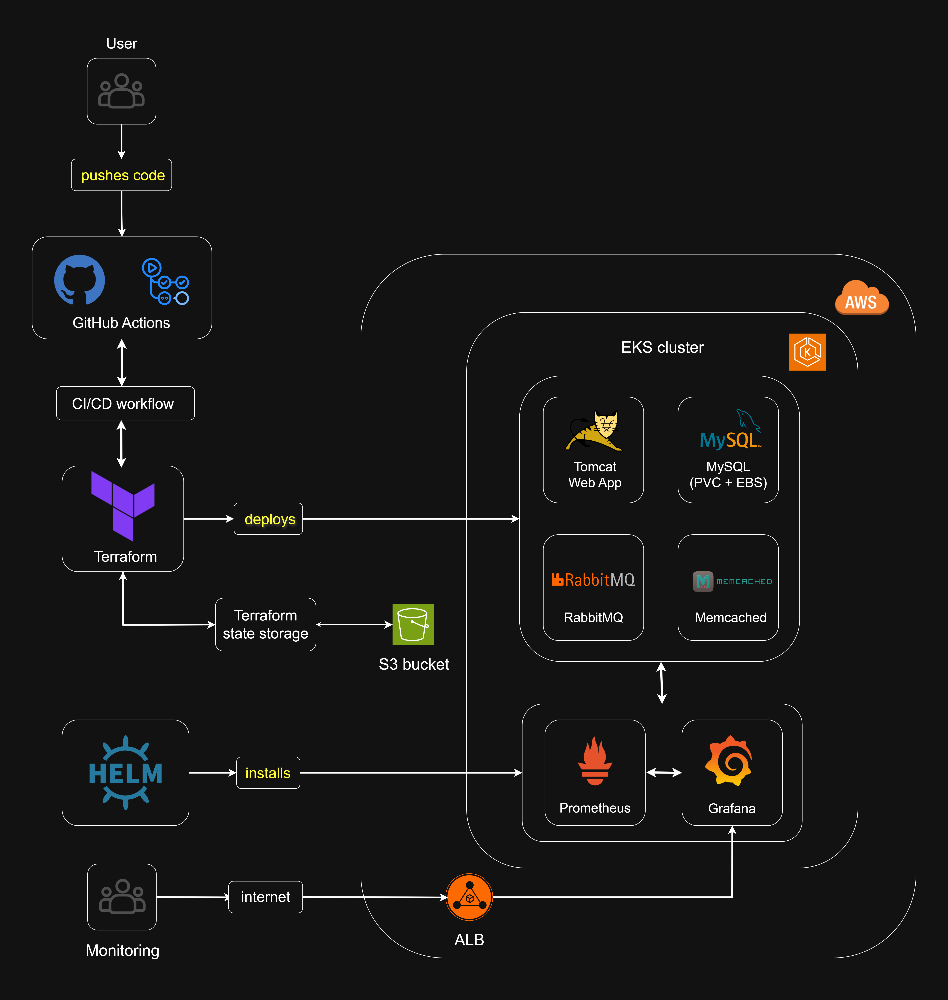

# Project 3: Provisioning of EKS deployment of Multi-service Java App  using Terraform with Git Hub Actions CI/CD and Observability pipeline 

[](#)
[](#)
[](#)
[](#)

This project demonstrates the deployment of a full-stack Java-based microservices application on **AWS EKS** using **Terraform**, **GitHub Actions**, and Kubernetes manifests. It also integrates **Prometheus** and **Grafana** for monitoring.

---

##  Part of a 3-Project DevOps Progression

This project is the **final milestone** in a self-designed 3-part DevOps portfolio projects designed to mirror the progression of infrastructure maturity in real-world engineering environments — from containerization, to orchestration, to full automation and observability on real world cloud infrastructure.

- **Project 1**: Multi-service containerization and deployment using Docker Compose on AWS EC2  [Project 1](https://github.com/ravi-rajyaguru15/Project-01-dockerized-multi-service-application)
- **Project 2**: Kubernetes orchestration of the same application stack on AWS EKS  [Project 2](https://github.com/ravi-rajyaguru15/Project-02-eks-k8s-infrastructure-orchestration)
- **Project 3 (this)**: Infrastructure-as-Code with Terraform, CI/CD via GitHub Actions, and monitoring using Prometheus and Grafana

---

## Project Overview

This project represents a production-style infrastructure pipeline, using Terraform to provision AWS infrastructure, GitHub Actions for CI/CD automation, and observability tools to monitor application and system health.

It automates the end-to-end deployment of a full-stack web application onto an EKS cluster, with persistent storage and network routing

The workflow is fully automated:
Just push code to main branch and GitHub Actions takes care of provisioning, deploying, and verifying.

---

##  Application Stack

| Layer      | Component        | Purpose                                  |
|------------|------------------|------------------------------------------|
| Web        | `web-app`        | Java web app via Tomcat (+ Maven build)  |
| Database   | `mysql`          | PVC-backed relational Database           |
| Messaging  | `rabbitmq`       | Queue-based messaging                    |
| Caching    | `memcached`      | In-memory caching layer                  |
| Ingress    | `nginx`          | HTTP routing & reverse proxy             |

---

## 🧩 Stack Overview

- **Infrastructure as Code:** Terraform
- **Cloud Provider:** AWS (EKS, EC2, VPC, IAM)
- **Container Orchestration:** Kubernetes
- **CI/CD:** GitHub Actions
- **Monitoring:** Prometheus + Grafana
- **Application:** Java-based microservices (Spring Boot)

---

## Architecture Overview



---

## Repository Structure
```text
Project_03/
│
├── .github/                                       # GitHub Actions CI/CD pipeline
│   └── workflows/                                
│       └── deploy.yaml
│
├── terraform/                                     # Modular Terraform setup for AWS EKS
│   ├── aws-ebs-csi.tf                             # EBS CSI driver IAM setup
│   ├── eks-cluster.tf                             # EKS control plane config
│   ├── main.tf                                    # Terraform provider & backend
│   ├── outputs.tf                                 # Generates info like cluster endpoint after infrastucture is provisioned
│   ├── terraform.tf                               # Terraform Dependencies
│   ├── variables.tf                               # Variables for AWS region and cluster name
│   └── vpc.tf                                     # VPC, subnets, NAT, etc.
│            
├── kubernetes/
│   ├── deployments/                               # Pods for app, mysql, rabbitmq, memcached 
│   │   ├── app-deployment.yaml                      and initContainers
│   │   ├── mysql-deployment.yaml
│   │   ├── rabbitmq-deployment.yaml
│   │   └── memcached-deployment.yaml
│   │
│   ├── services/                                  # ClusterIP services      
│   │   ├── web-app-service.yaml
│   │   ├── mysql-service.yaml
│   │   ├── rabbitmq-service.yaml
│   │   └── memcached-service.yaml
│   │
│   ├── ingress/                                   # NGINX ingress resource
│   │   └── nginx-ingress.yaml
│   │
│   ├── secrets/                                   # Base64 encoded secrets containing MySQL 
│   │   └── secrets.yaml                             and RabbitMQ credentials
│   │
│   └── persistentVolumeClaim/                     # MySQL PVC
│       └── mysql-pvc.yaml
│      
├── images/
|   ├── screenshots/...                            # Screenshots of k8s pods & services, terraform apply & plan, CI/CD pipeline, Grafana monitoring, etc.
│   └── architecture/
|         └── project-3-architecture.png           # Architecture overview diagram of Project 3
│      
├── legacy/                                        # Files and artifacts carried over from project 1 and 2  
│   ├── app/...                                      for continuity purposes, but are not an active  
│   ├── mysql/...                                    part of project 3.
│   ├── nginx/...
│   ├── images/...                         
│   ├── .env                                                                           
│   ├──docker-compose.yaml
│   └──project2-eksctl-config.yaml 
│ 
├── .gitignore                                     # gitignore file to prevent large runtime generated files from pushing into repository.                     
│                     
└── README.md                                      # Project README (You are here) (Inception!)
```
---

## How to Deploy (Reproduction steps)

---

## Engineering Decisions

- **Terraform-Only Infrastructure**: No manual AWS setup. Every component is provisioned via Terraform — including VPC, subnets, NAT, internet gateway, EKS cluster, worker nodes, and IAM policies.
- **GitHub Actions CI/CD Pipeline**:
     - Pipeline split into 4 separate jobs: Terraform Plan → Terraform Apply → Kubernetes Apply → Verify Deployment.
     - Secret management is handled securely via GitHub Secrets.
     - The pipeline ensures a zero-touch deployment after pushing to main.
- **EBS CSI Driver via Terraform**:
     - Required for MySQL persistent storage.
     - IAM role is programmatically attached using an additional Terraform file.
- **Kubernetes Infrastructure**:
     - Manifests are modular: secrets, services, PVC, deployments, ingress.
     - All manifests are written manually, not scaffolded - taken over from Project 2 - ensures reusability and saves time
     - initContainers used for readiness sequencing (e.g., MySQL PVC needs cleaning before mount).
- **Observability with Prometheus & Grafana**:
     - Monitoring is enabled through Prometheus scraping.
     - Grafana dashboards are used for pod, node, and app health.
     - Screenshots included as visual proof of observability.
- **Debugging Real-World Issues**: Solved a number of realistic issues like:
     - IAM bindings for EBS CSI - automated it instead of performing manual patchwork everytime
     - CrashLoopBackOff due to initContainer misconfiguration, and PVC mounting error.
     - Prometheus service pod not initializing due to Persistent Volume not binding - solved via disabling PV ensuring quick troubleshooting deployment.
- **Docker Hub registry images rebuilt**:  Custom web app changes were not reflected in previous Docker image — rebuilt and pushed custom app image to Docker Hub again to preserve integrity. Read Attribution for more information regarding custom web app changes.

ELB not routing due to NGINX misannotations

---

## Attribution
The Java web application used in this project was externally sourced. All containerization, orchestration, deployment strategy, and infrastructure setup were independently implemented. Although it being way out of scope, and to ensure the system appeared more production-ready and portfolio-appropriate, all course-specific branding was removed; UI elements and presentation were modified to reflect a generic, open-source-style web application. 

A delibrate and calculated decision was also made to use the same web apllication throughout all 3 projects. This allowed full attention to be directed towards infrastructure, deployment, and DevOps process engineering.

---